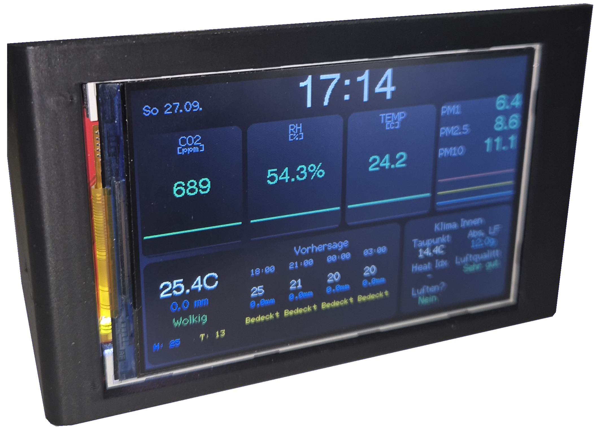

# Air-Quality-Monitor

This is a guide to build your own Air-Quality-Monitor (**AQM**). The AQM measures CO2, relative humidity, temperature and particulate matter. The current readings are displayed on a 4-inch TFT screen. The device is connected to the local network via Wi-Fi to synchronise time.

  

# Table of Contents

- [Parts](#parts)
- [Assembly](#assembly)
- [Installation](#installation)
- [Settings](#settings)
- [Price](#price)
- [Notes](#notes)

# Parts

- ESP32S
- SCD41 CO₂ Sensor
- SHT40 Temperature & Humidity Sensor
- SPS30 Particulate Matter Sensor
- VEML7700 Ambient Light Sensor
- ILI9488 4 Inch TFT Display

# Assembly

To assembel the AQM you should first start with testing all the components on a bredboard which are connected as in figure X. After checking the functinality of all components and printing the body of the case you start by soldering the components to each other as shown in figure Y. Start with screwing the TFT display in place (depending on screw length you have to use washers/springs). After that place the SPS30 in the lower corner with the connector facing the dividing wall of the case. Then you can screw in the SHT40 into its respectiv mounting holes. The SCD41 is mounted using a wedge because of the missing mounting holes. At last step mount the VEML7700 with the pins facing inside and then close the lid of the AQM.

# Installation

After wiring up all components you just need to download the Code and flash it to the ESP32 using the Arduino IDE or similar programms. 

# Settings

All different settings can be changed in the "config.h" file. 

# Price

| Part | Price |
|----------|--------|
| ESP32S | 3,42 € |
| SCD41  | 17,99 € |
| SHT40  | 2,79 € |
| SPS30  | 10,45 € |
| VEML7700 | 1,66 € |
| ILI9488 4" TFT Display | 13,52 € |
| **Total** | **49.68 €** |

\* All parts sourced on Aliexpress Mai 2026

# Notes

Future Home Assistant integration is planned. 
